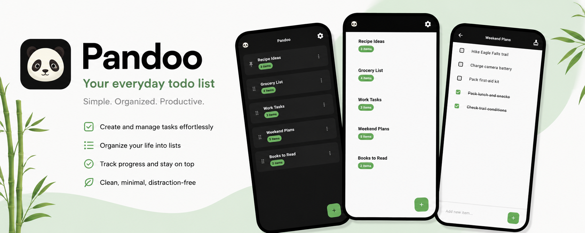

<picture>
  <source media="(prefers-color-scheme: dark)" srcset="assets/images/github/banner.png">
  
</picture>

<p align="center">
  <a href="LICENSE"></a>
  
  
  
</p>

<p align="center">
  <a href="https://play.google.com/store/apps/details?id=com.teamsuperpanda.pandoo"></a>
  <a href="https://apps.apple.com/us/app/pandoo/id1559676245"></a>
</p>

Your friendly, local-first todo list. Fast. Minimal. Private. No clouds, no accounts - just you and your tasks.

Built by [Team Super Panda](https://www.teamsuperpanda.com).

---

## What it does

Pandoo is a no-nonsense todo app that keeps your data on your device.

- **Stay organized** - multiple lists, custom ordering, pin what matters.
- **Task mastery** - checkboxes, drag-and-drop reordering, smart sorting.
- **Search within lists** - filter items in seconds, even with hundreds of tasks.
- **Dark & light themes** - with multi-language support (70+ locales).
- **Privacy first** - your data never leaves your device. Zero servers.

---

## Tech

| Layer | Choice |
|---|---|
| UI | Flutter with Hive reactive listeners |
| Storage | Hive (local, no server) |
| L10n | ARB + flutter gen-l10n |
| Fonts | Inter (bundled, no network calls) |

No backend. No sync. No app data leaves your device.

---

## Run it

```bash
git clone https://github.com/teamsuperpanda/pandoo.git
cd pandoo
flutter pub get
flutter run
```

### Tests

```bash
flutter test --coverage
```

---

## License

The code is [PolyForm Noncommercial 1.0.0](LICENSE). Free for personal use, not for resale.
Assets are copyright 2026 Team Super Panda (see [ASSETS-LICENSE.md](ASSETS-LICENSE.md)).
